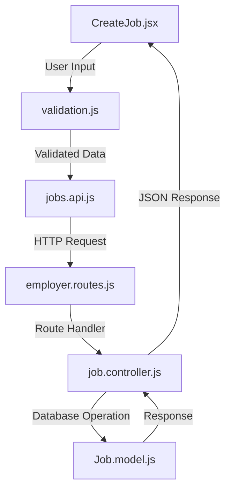
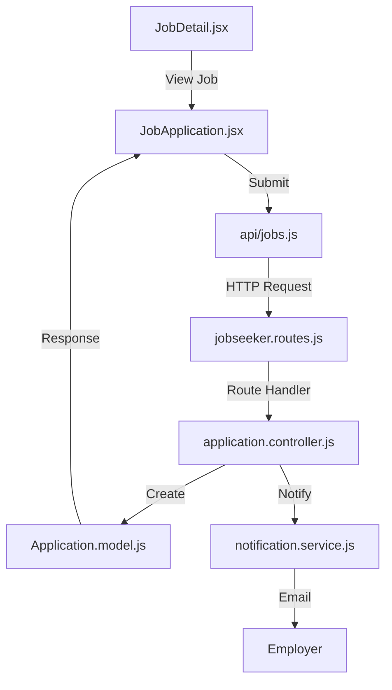
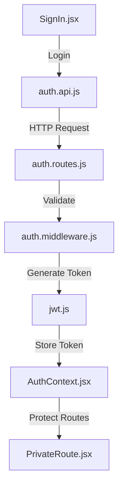
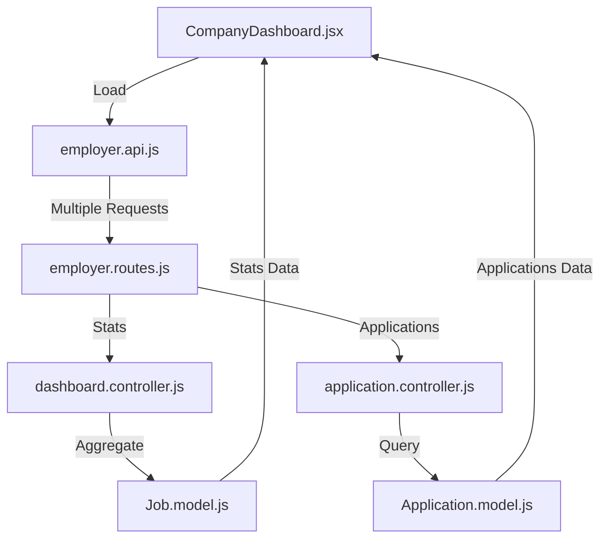
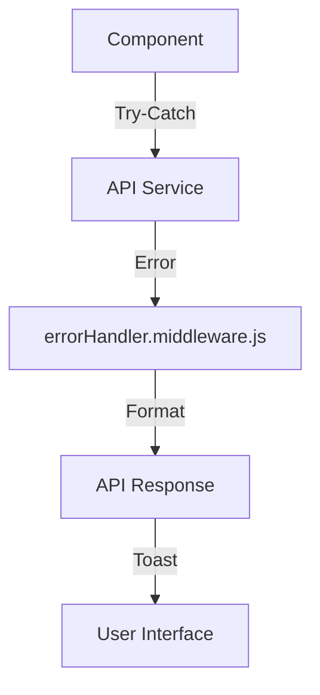

# CAPSTONE-PROJECT
The modern job market presents significant challenges for both employers and job seekers.  Employers struggle to find qualified candidates efficiently, while job seekers face a fragmented  and often overwhelming application process


# Web Application Directory Structure

job-portal/
├── client/
│   ├── public/
│   │   ├── index.html
│   │   └── assets/
│   │       ├── images/
│   │       └── icons/
│   ├── src/
│   │   ├── components/
│   │   │   ├── admin/
│   │   │   │   ├── Dashboard/
│   │   │   │   │   ├── Statistics.jsx
│   │   │   │   │   ├── UserManagement.js
│   │   │   │   │   └── SystemConfig.jsx
│   │   │   │   ├── Reports/
│   │   │   │   │   ├── UserReport.jsx
│   │   │   │   │   └── ActivityReport.jsx
│   │   │   │   └── ContentManagement/
│   │   │   │       ├── Categories.jsx
│   │   │   │       └── SystemNotifications.jsx
│   │   │   ├── employer/
│   │   │   │   ├── Profile/
│   │   │   │   │   ├── CompanyProfile.jsx
│   │   │   │   │   └── CompanySettings.jsx
│   │   │   │   ├── Jobs/
│   │   │   │   │   ├── CreateJob.jsx
│   │   │   │   │   ├── EditJob.jsx
│   │   │   │   │   └── JobList.jsx
│   │   │   │   └── Applications/
│   │   │   │       ├── ApplicationList.jsx
│   │   │   │       ├── ApplicationDetails.jsx
│   │   │   │       └── InterviewScheduler.jsx
│   │   │   ├── jobseeker/
│   │   │   │   ├── Profile/
│   │   │   │   │   ├── PersonalProfile.jsx
│   │   │   │   │   ├── ResumeBuilder.jsx
│   │   │   │   │   └── SkillsAssessment.jsx
│   │   │   │   ├── Jobs/
│   │   │   │   │   ├── JobSearch.jsx
│   │   │   │   │   ├── SavedJobs.jsx
│   │   │   │   │   └── JobAlerts.jsx
│   │   │   │   └── Applications/
│   │   │   │       ├── MyApplications.jsx
│   │   │   │       └── ApplicationStatus.jsx
│   │   │   └── shared/
│   │   │       ├── Layout/
│   │   │       │   ├── Navbar.jsx
│   │   │       │   └── Footer.jsx
│   │   │       ├── Forms/
│   │   │       │   ├── InputField.jsx
│   │   │       │   └── FileUpload.jsx
│   │   │       └── UI/
│   │   │           ├── Modal.jsx
│   │   │           ├── Button.jsx
│   │   │           └── Card.jsx
│   │   ├── pages/
│   │   │   ├── Home.jsx
│   │   │   ├── About.jsx
│   │   │   ├── Contact.jsx
│   │   │   └── NotFound.jsx
│   │   ├── services/
│   │   │   ├── api/
│   │   │   │   ├── auth.js
│   │   │   │   ├── job.js
│   │   │   │   └── user.js
│   │   │   └── helpers/
│   │   │       ├── storage.js
│   │   │       └── notification.js
│   │   ├── context/
│   │   │   ├── AuthContext.jsx
│   │   │   └── ThemeContext.jsx
│   │   └── utils/
│   │       ├── validation.js
│   │       └── formatters.js
│   └── package.json
│
├── server/
│   ├── config/
│   │   ├── database.js
│   │   └── jwt.js
│   ├── controllers/
│   │   ├── admin/
│   │   │   ├── userManagement.js
│   │   │   ├── reportController.js
│   │   │   └── systemController.js
│   │   ├── employer/
│   │   │   ├── profileController.js
│   │   │   ├── jobController.js
│   │   │   └── applicationController.js
│   │   └── jobseeker/
│   │       ├── profileController.js
│   │       ├── applicationController.js
│   │       └── searchController.js
│   ├── middleware/
│   │   ├── auth.js
│   │   ├── roleCheck.js
│   │   ├── validation.js
│   │   └── errorHandler.js
│   ├── models/
│   │   ├── User.js
│   │   ├── Company.js
│   │   ├── Job.js
│   │   ├── Application.js
│   │   └── Category.js
│   ├── routes/
│   │   ├── admin.routes.js
│   │   ├── employer.routes.js
│   │   ├── jobseeker.routes.js
│   │   └── auth.routes.js
│   ├── services/
│   │   ├── email.service.js
│   │   ├── storage.service.js
│   │   └── notification.service.js
│   └── utils/
│       ├── validators.js
│       └── helpers.js
│
├── docs/
│   ├── api/
│   │   └── swagger.yaml
│   ├── database/
│   │   └── schema.sql
│   └── guides/
│       ├── admin-guide.md
│       ├── employer-guide.md
│       └── jobseeker-guide.md
│
├── tests/
│   ├── unit/
│   │   ├── admin/
│   │   ├── employer/
│   │   └── jobseeker/
│   └── integration/
│       ├── auth.test.js
│       ├── jobs.test.js
│       └── applications.test.js
│
├── .env.example
├── .gitignore
├── README.md
└── package.json


## Key Components Description

Frontend (client/)

1. components/: Reusable UI components
   - auth/: Authentication related components
   - dashboard/: Different user type dashboards
   - jobs/: Job posting and application components
   - shared/: Common components like navbar

# User Roles and Access Control Features

## 1. Admin Features
Administrator has full system control and oversight:

### Access Rights:
- Full access to all system features and data
- User management across all roles
- System configuration and monitoring

### Specific Features:
1. **User Management**
   - View all users (employers and job seekers)
   - Approve/reject employer registrations
   - Suspend/activate user accounts
   - Reset user passwords

2. **Job Posting Management**
   - Review and moderate job postings
   - Remove inappropriate content
   - View all job postings statistics

3. **System Administration**
   - Dashboard with system statistics
   - Generate reports (user activity, job postings, applications)
   - Manage system settings
   - Monitor system performance

4. **Content Management**
   - Manage categories/industries
   - Update system notifications
   - Manage static content (FAQs, Terms of Service)

## 2. Employer Features
Employers can manage their company profile and job postings:

### Access Rights:
- Company profile management
- Job posting management
- Applicant management

### Specific Features:
1. **Profile Management**
   - Create/edit company profile
   - Upload company logo
   - Add company description
   - Update contact information

2. **Job Management**
   - Create new job postings
   - Edit existing job postings
   - Delete/archive job postings
   - Set job status (active/inactive)

3. **Applicant Management**
   - View job applications
   - Filter and search applications
   - Download resumes
   - Update application status
   - Contact applicants

4. **Dashboard Features**
   - View application statistics
   - Track posting performance
   - Manage shortlisted candidates
   - Schedule interviews

## 3. Job Seeker Features
Job seekers can search for jobs and manage their applications:

### Access Rights:
- Personal profile management
- Job application functions
- Application tracking

### Specific Features:
1. **Profile Management**
   - Create/edit personal profile
   - Upload/update resume
   - Add skills and experience
   - Set job preferences

2. **Job Search**
   - Search for jobs
   - Filter jobs by various criteria
   - Save job searches
   - Set job alerts

3. **Application Management**
   - Apply to jobs
   - Track application status
   - View application history
   - Save favorite jobs

4. **Career Tools**
   - Resume builder
   - Skills assessment
   - Job match recommendations
   - Application tracking

## Access Control Matrix

Feature                     | Admin | Employer | Job Seeker
---------------------------|--------|----------|------------
User Management            |   ✓    |    ✗     |     ✗
System Configuration       |   ✓    |    ✗     |     ✗
View All Users            |   ✓    |    ✗     |     ✗
Company Profile           |   ✓    |    ✓     |     ✗
Create Job Postings       |   ✓    |    ✓     |     ✗
Edit Job Postings         |   ✓    |    ✓     |     ✗
View Applications         |   ✓    |    ✓     |     ✗
Personal Profile          |   ✓    |    ✓     |     ✓
Apply to Jobs            |   ✗    |    ✗     |     ✓
Search Jobs              |   ✓    |    ✓     |     ✓
Generate Reports         |   ✓    |    ✗     |     ✗
Manage Categories        |   ✓    |    ✗     |     ✗
Contact Support          |   ✓    |    ✓     |     ✓


### BUILDING THE FRONTEND

1. Install dependencies:
   ```bash
   npm install
   ```

# Create a new React project using Vite
npm create vite@latest job-portal -- --template react

# Navigate into the project directory
cd job-portal

# Install dependencies
npm install

# Create the directory structure inside the src folder
mkdir -p src/{components,pages,services,context,utils}
mkdir -p src/components/{admin,employer,jobseeker,shared}
mkdir -p src/components/admin/{Dashboard,Reports,ContentManagement}
mkdir -p src/components/employer/{Profile,Jobs,Applications}
mkdir -p src/components/jobseeker/{Profile,Jobs,Applications}
mkdir -p src/components/shared/{Layout,Forms,UI}
mkdir -p src/services/{api,helpers}

# Create component files
touch src/components/admin/Dashboard/{Statistics,UserManagement,SystemConfig}.jsx
touch src/components/admin/Reports/{UserReport,ActivityReport}.jsx
touch src/components/admin/ContentManagement/{Categories,SystemNotifications}.jsx
touch src/components/employer/Profile/{CompanyProfile,CompanySettings}.jsx
touch src/components/employer/Jobs/{CreateJob,EditJob,JobList}.jsx
touch src/components/employer/Applications/{ApplicationList,ApplicationDetails,InterviewScheduler}.jsx
touch src/components/jobseeker/Profile/{PersonalProfile,ResumeBuilder,SkillsAssessment}.jsx
touch src/components/jobseeker/Jobs/{JobSearch,SavedJobs,JobAlerts}.jsx
touch src/components/jobseeker/Applications/{MyApplications,ApplicationStatus}.jsx
touch src/components/shared/Layout/{Navbar,Footer}.jsx
touch src/components/shared/Forms/{InputField,FileUpload}.jsx
touch src/components/shared/UI/{Modal,Button,Card}.jsx

# Create pages
touch src/pages/{Home,About,Contact,NotFound}.jsx

# Create service files
touch src/services/api/{auth,job,user}.js
touch src/services/helpers/{storage,notification}.js

# Create context files
touch src/context/{AuthContext,ThemeContext}.jsx

# Create utility files
touch src/utils/{validation,formatters}.js

# Install routing
npm install react-router-dom

# Install styling and UI libraries
npm install @mui/material @emotion/react @emotion/styled
npm install @mui/icons-material
npm install tailwindcss postcss autoprefixer

# Install form handling
npm install react-hook-form yup @hookform/resolvers

# Install state management
npm install @reduxjs/toolkit react-redux

# Install HTTP client
npm install axios

# Install utilities
npm install date-fns
npm install classnames

# Initialize Tailwind CSS
npx tailwindcss init -p


# implemented several key components and utility files for the job portal application:

# /ResumeBuilder.jsx:

A comprehensive form for creating and editing resumes
Sections for personal information, work experience, education, and skills
Dynamic form fields with add/remove functionality
Styled with Tailwind CSS and custom utility classes

# /SkillsAssessment.jsx:

A component for displaying and taking skill assessment tests
Categorized tests with difficulty levels and descriptions
Search and filter functionality
Modern card-based UI with responsive design

# /formatters.js:

Utility functions for formatting various data types
Date formatting with multiple options (full, short, relative)
Currency and number formatting
File size and duration formatting
Text truncation and case conversion

# /validation.js:

Comprehensive form validation utilities
Email, password, URL, and phone number validation
File validation for size and type
Required field validation
Length and range validation
Custom validator creation

# /styles.js:

Utility functions for managing styles and class names
Class name concatenation with conditional support
Gradient and shadow generation
Transition and animation helpers
Responsive design utilities
Glass effect and hover effect styles

# Application Flow and File Connections

## 1. Job Creation Process Flow



### Files Involved:
1. **Frontend Components**:
   - `src/components/employer/Jobs/CreateJob.jsx`: Job creation form
   - `src/utils/validation.js`: Form validation rules
   - `src/services/api/jobs.js`: API service for job operations

2. **Backend Routes & Controllers**:
   - `server/routes/employer.routes.js`: Route definitions
   - `server/controllers/employer/jobController.js`: Business logic
   - `server/models/Job.js`: Database model

### Process:
1. User fills form in `CreateJob.jsx`
2. Data validated using `validation.js`
3. `jobs.api.js` sends POST request to backend
4. Request processed through middleware (auth, validation)
5. Controller handles business logic
6. Database operation performed
7. Response sent back to frontend

## 2. Job Application Process



### Files Involved:
1. **Frontend**:
   - `src/components/jobseeker/Jobs/JobDetail.jsx`: Job details display
   - `src/components/jobseeker/Jobs/JobApplication.jsx`: Application form
   - `src/services/api/jobs.js`: API service

2. **Backend**:
   - `server/routes/jobseeker.routes.js`: Application routes
   - `server/controllers/jobseeker/applicationController.js`: Application logic
   - `server/models/Application.js`: Application model
   - `server/services/notification.service.js`: Notification handling

### Process:
1. User views job in `JobDetail.jsx`
2. Applies through `JobApplication.jsx`
3. Application data sent to backend
4. Saved in database
5. Notifications sent to employer
6. Response returned to frontend

## 3. Authentication Flow



### Files Involved:
1. **Frontend Auth**:
   - `src/pages/auth/SignIn.jsx`: Login form
   - `src/services/api/auth.js`: Auth API service
   - `src/context/AuthContext.jsx`: Auth state management
   - `src/components/shared/PrivateRoute.jsx`: Route protection

2. **Backend Auth**:
   - `server/routes/auth.routes.js`: Auth routes
   - `server/middleware/auth.js`: Auth middleware
   - `server/config/jwt.js`: JWT configuration

### Process:
1. User submits login credentials
2. Frontend validates and sends to backend
3. Backend authenticates and generates token
4. Token stored in AuthContext
5. Protected routes check auth state

## 4. Data Flow in Company Dashboard



### Files Involved:
1. **Frontend Dashboard**:
   - `src/pages/CompanyDashboard.jsx`: Main dashboard
   - `src/services/api/employer.js`: API services
   - `src/utils/formatters.js`: Data formatting

2. **Backend Processing**:
   - `server/controllers/employer/dashboard.controller.js`: Stats logic
   - `server/controllers/employer/application.controller.js`: Application data
   - `server/models/`: Database models

### Process:
1. Dashboard component mounts
2. Multiple API calls made through services
3. Backend controllers gather data
4. Data formatted and displayed
5. Real-time updates through WebSocket (if implemented)

## 5. Utility Functions and Services

### Frontend Utilities:
- `src/utils/validation.js`: Form validation
- `src/utils/formatters.js`: Data formatting
- `src/utils/styles.js`: Style management

### Backend Services:
- `server/services/email.service.js`: Email notifications
- `server/services/storage.service.js`: File handling
- `server/services/notification.service.js`: User notifications

### Connection:
- Frontend utilities support component functionality
- Backend services handle complex operations
- Services communicate through API layer

## 6. Error Handling Flow



### Implementation:
1. Components use try-catch
2. API services handle request errors
3. Backend middleware formats errors
4. Frontend displays user-friendly messages

This documentation provides a clear understanding of how different parts of the application work together to create a functional job portal system.
